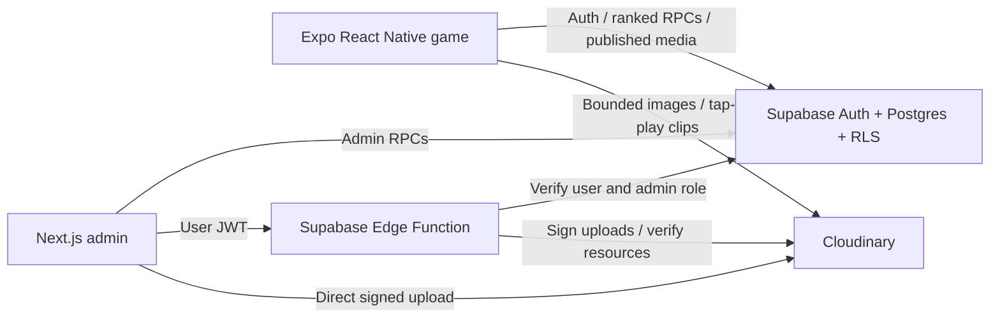

# Orbit Roll admin — Next.js

A separate Next.js App Router application. Expo owns the player experience; this app owns administration. Supabase owns authentication, authorization, scores, moderation, and media metadata. Cloudinary owns image/video bytes and delivery. No Next.js server or paid image optimizer is required: the admin builds to static HTML/JS.



## Local development

From the repository root:

```sh
npm ci
npm ci --prefix apps/admin
npm run admin:dev
```

Copy this folder's `.env.example` to `.env.local` if it does not already exist. Set `NEXT_PUBLIC_SUPABASE_URL` and `NEXT_PUBLIC_SUPABASE_PUBLISHABLE_KEY` to the same project used by Expo. These are public client values; never add a Supabase service key or Cloudinary API secret here. Admin uses a separate browser auth storage key from the player website.

Sign in with an existing account provisioned in `private.admin_users`. Admin login does not create accounts. See [Supabase setup](../../supabase/README.md) for email-code templates and role provisioning. Every database and media operation rechecks authorization server-side; hiding UI is not the security boundary.

## Cloudinary setup — free Image and Video APIs plan

1. Create a Cloudinary **Image and Video APIs Free** account (not the separate time-limited Assets DAM trial).
2. Create two **signed** upload presets. Keep unsigned uploads disabled for these presets:
   - `orbit_roll_images`: `allowed_formats: jpg,png,webp`; `max_file_size: 2097152`.
   - `orbit_roll_videos`: `allowed_formats: mp4,webm`; `max_file_size: 10485760`.
3. Leave extra folder/public-ID rewriting, auto-tagging, AI add-ons, eager video transformations, and backup/revision extras off for these presets. The Edge Function fixes the public ID to `orbit-roll/<ticket UUID>`, uses `overwrite=false`, and serves ordinary public uploads.
4. Apply **all unapplied migrations** in order. The new media schema is `supabase/migrations/202609090003_media.sql`. Do not rerun already applied migrations.
5. Configure the following **Supabase Edge Function secrets** in the dashboard, or with a private untracked environment file:

```dotenv
ADMIN_ORIGINS=http://localhost:3000,https://YOUR_ADMIN_HOST
CLOUDINARY_CLOUD_NAME=YOUR_CLOUD_NAME
CLOUDINARY_API_KEY=YOUR_API_KEY
CLOUDINARY_API_SECRET=YOUR_API_SECRET
CLOUDINARY_IMAGE_PRESET=orbit_roll_images
CLOUDINARY_VIDEO_PRESET=orbit_roll_videos
```

`ADMIN_ORIGINS` contains exact origins (scheme + host + port), **no path or trailing slash**. For the shared private preview use `https://orbit-roll-crew.devesh-rn.chatgpt.site`. Origins are an extra browser boundary; verified JWTs and server-side admin roles are required regardless. Supabase automatically supplies `SUPABASE_URL`, `SUPABASE_ANON_KEY`, and `SUPABASE_SERVICE_ROLE_KEY` to hosted functions.

```sh
supabase link --project-ref YOUR_PROJECT_REF
supabase db push --dry-run
supabase db push
supabase secrets set --env-file supabase/functions/.env.local
supabase functions deploy cloudinary-media
```

Keep JWT verification enabled as configured in `supabase/config.toml`. The handler additionally validates the user through Auth and checks `is_admin` before signing or verifying media. The service-role client is created only inside the Edge Function to register provider-verified metadata. It never signs in a browser or mobile client.

## Upload and publication workflow

An admin reserves a ticket, uploads directly to Cloudinary with a server signature, and asks the Edge Function to verify it. The function retrieves the actual resource from Cloudinary's Admin API; browser-supplied URLs, byte sizes, formats, and durations are never trusted. Verified media starts as a draft. Publish/unpublish requires a note and creates an audit entry. Only published rows are visible to unauthenticated users and normal players.

Controls: 2 MB images; 10 MB / 30-second videos; 4096-pixel maximum dimensions; 5 reservations/admin/hour; 20 reservations globally/day; at most 10 verification attempts/ticket. New reservations stop when registered media reaches 200 MB. This is an ingestion guard, not a Cloudinary billing cap: in-flight uploads, rejected files, CDN views, or files uploaded outside the app may consume additional usage. Check both provider dashboards weekly.

Interrupted verification can be retried without another upload. The last ticket is saved in browser session storage, scoped to the admin; it can also be entered manually for 24 hours. Already registered tickets skip the Cloudinary lookup. Dismissing a ticket does not delete a provider file. Inspect rejected/orphaned uploads in Cloudinary and remove them manually. Unpublishing hides the app listing but does not delete bytes or revoke public CDN URLs. These assets must not contain confidential data.

Expo's `/media` gallery lists published files in pages of 12. Images use only 320/640-width Cloudinary delivery variants; videos load after a tap and pause when the app backgrounds or the screen loses focus. Core game artwork, Skia paths, and Lottie effects remain bundled for offline play. Rebuild the native development client after installing `expo-video`.

## Free-tier operating plan

Checked September 9, 2026; provider limits can change.

| Service | Starting plan | Relevant limits / action |
| --- | --- | --- |
| Supabase | Free | 50,000 MAU, 500 MB database, 5 GB egress, 500,000 Edge Function calls; inactive projects may pause after one week. Keep only structured data in Postgres. |
| Cloudinary Image and Video APIs | Free | 25 shared monthly credits across transformations, storage, and bandwidth. Videos can consume these quickly. |
| Next.js static admin | Cloudflare Pages Free or existing private Sites preview | No continuously running Node server. Pages supports static Next.js exports and has 500 builds/month on Free. |
| Sign-in email | Custom SMTP, such as Resend Free if eligible | Resend currently allows 100/day and 3,000/month. Verify your sender domain. Supabase's default mailer only serves project-team addresses at 2 messages/hour. |

Treat 1,000 downloads as a review milestone, not a guaranteed free capacity boundary. Review upgrades at 70–80% of any actual quota, or when availability/support needs increase. Do not add fake activity to evade free-project pausing. Back up database data yourself while using a plan without automatic backups. Public app-store distribution, domain registration, and optional build services have separate costs; no paid subscriptions or automatic upgrades are enabled by this code.

Vercel Hobby is restricted to personal, non-commercial use; do not use it as the free production host for this business admin without confirming plan eligibility. Static hosting keeps the Next.js architecture portable.

Sources: [Supabase pricing](https://supabase.com/pricing), [Cloudinary pricing](https://cloudinary.com/pricing), [Cloudinary credit accounting](https://cloudinary.com/documentation/billing_and_plans), [Cloudflare Pages limits](https://developers.cloudflare.com/pages/platform/limits/), [Supabase SMTP](https://supabase.com/docs/guides/auth/auth-smtp), [Resend limits](https://resend.com/docs/knowledge-base/account-quotas-and-limits), [Vercel fair use](https://vercel.com/docs/limits/fair-use-guidelines).

## Build and deployment

Standalone admin:

```sh
npm run admin:check
npm run admin:build
```

Host `apps/admin/out` as static files. For Cloudflare Pages, set root directory `apps/admin`, build command `npm run build`, output `out`, and the two `NEXT_PUBLIC_*` environment variables. Do not set `ADMIN_BASE_PATH` when serving the admin at its own domain root. Server Actions/API routes are intentionally absent; backend work stays in Supabase.

Shared private preview, with Expo at `/` and Next.js at `/admin/`:

```sh
npm run export:site
```

This builds Next.js with `ADMIN_BASE_PATH=/admin` and stages its static output under `dist/admin`. The root `.openai/hosting.json` continues to own the same private Site. Set `EXPO_PUBLIC_ADMIN_URL` to the deployed admin URL so the Expo admin shortcut opens the correct web app. A private preview is not public player distribution.

## Checks and launch verification

Root CI checks both applications, game and media-policy tests, and disposable PostgreSQL integration tests (including draft privacy, service-only metadata registration, publication authorization, audit reasons, and upload quotas). `deno check supabase/functions/cloudinary-media/index.ts` validates the Edge Function. A read-only WebMCP admin tool is feature-detected; it was not browser-verified in this environment.

Before inviting users: deploy the migrations/function, configure signed presets/secrets/SMTP, and test a real image upload and a short video upload, verification retry, draft-to-public publication, unpublication, denied non-admin calls, native tap-to-play/backgrounding, and both provider usage dashboards. Local checks cannot verify an unconfigured Cloudinary account or hosted email delivery.
